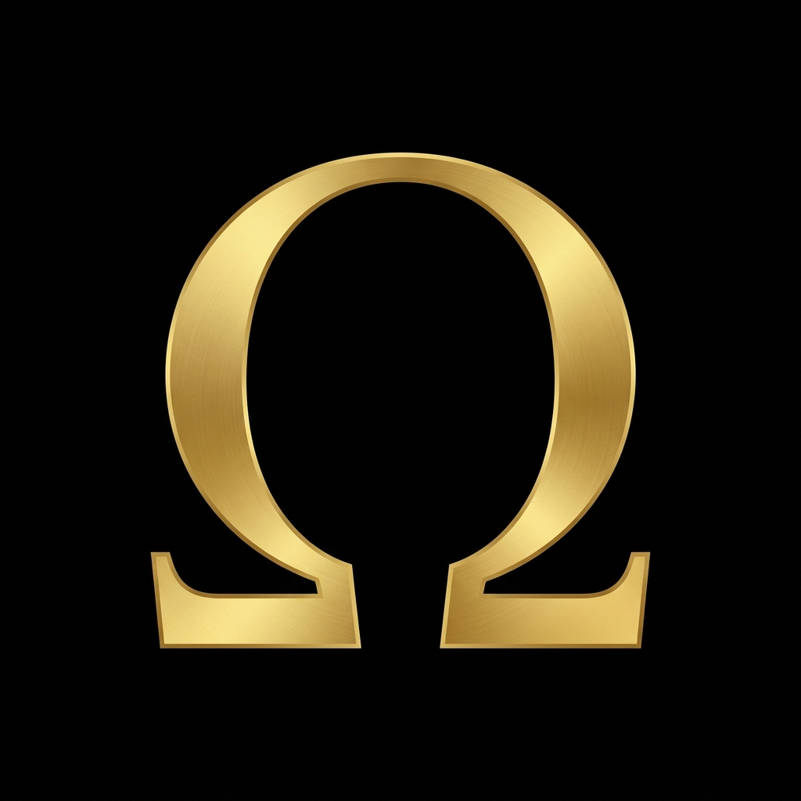

<div align="center">
  
  <h1>GRAVITY OMEGA</h1>
  <p><strong>Autonomous AI-Powered IDE & Intelligence Platform</strong></p>
  <p><em>Examina omnia, venerare nihil, pro te cogita.</em></p>
</div>


---

Gravity Omega is a sovereign AI development environment built on the **VERITAS** framework. It integrates a full-stack Electron frontend with a hardened Python backend running 60+ autonomous modules across 4 execution DAGs.

> **Zero cloud dependency. Everything runs on your hardware.**

## Architecture

```
+------------------------------------+
|         GRAVITY OMEGA v2           |
+------------------------------------+
| ELECTRON MAIN (main.js)           |
|   IPC Bridge + Window Management  |
+------------------------------------+
| RENDERER (HTML/CSS/JS)            |
|   Monaco Editor + Terminal HUD    |
+------------------------------------+
| PYTHON BACKEND (60+ modules)      |
|   Tri-Node VTP Architecture       |
|   Brain / Bridge / Cortex / Shield|
+------------------------------------+
```

### Tri-Node VTP Engine

| Node | Role | Function |
|------|------|----------|
| **Brain** | Intelligence Core | Multi-model LLM routing (Vertex AI, Ollama, OpenAI), context assembly, provenance RAG |
| **Bridge** | Execution Layer | VTP parser (5 strategies, 12 post-parse gates), system command executor, file operations |
| **Cortex** | Validation Layer | Tri-node approval gating, semantic similarity checks, drift correction |
| **Shield** | Security Layer | A3 anti-pattern gate, known-fixes memory (27+ patterns), pre-flight validation |

### 4 Execution DAGs

| DAG | Scope |
|-----|-------|
| **Code DAG** | Write, edit, refactor, deploy |
| **Research DAG** | Web search, document analysis, knowledge synthesis |
| **System DAG** | OS commands, process management, file operations |
| **Meta DAG** | Self-improvement, prompt tuning, context optimization |

## Features

- **Autonomous Agentic Loop** - Multi-turn task execution with self-correction
- **Monaco Code Editor** - Full VS Code editing experience with syntax highlighting
- **Integrated Terminal** - Direct shell access with output capture
- **Multi-Model LLM Backend** - Vertex AI, Ollama (local), OpenAI with automatic fallback
- **Provenance RAG** - Semantic search over ingested knowledge with VERITAS scoring
- **SEAL Audit Chain** - Tamper-evident SHA-256 hash chain for all operations
- **Project Context Loader** - Automatic file tree analysis and context injection
- **Known Fixes Memory** - Pattern-matched solutions from historical resolutions
- **Unkillable Backend** - Watchdog with auto-respawn (MAX_RETRIES=999)

## Quick Start

### Requirements
- Node.js 20+
- Python 3.10+
- Ollama (for local LLM inference)

### Install

```bash
# Install Electron dependencies
npm install

# Install Python backend dependencies
cd backend
pip install -r requirements.txt

# Start the application
npm start
```

## Security

- **Zero-Trust IPC** - All renderer-to-backend communication passes through validated IPC channels
- **A3 Content Gate** - 6 anti-pattern detectors (4 hard-reject, 2 soft-warn) block dangerous operations
- **Pre-Flight Validation** - Node-fetch, debug flags, and venv checks before execution
- **Process Isolation** - Python backend runs in separate process with health-check monitoring

## License

MIT

---

<div align="center">
  <sub>Built by <a href="https://github.com/VrtxOmega">RJ Lopez</a> | VERITAS Framework</sub>
</div>