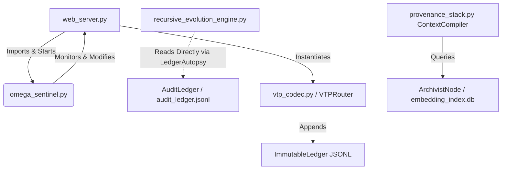

# Multi-Dimensional Codebase Analysis

## 1. ADVERSARIAL SECURITY AUDIT

### A. VTP HMAC-SHA256 Signing Flow
- **Exploit Description (OOM & Replay via Memory Leak):** The `VTPRouter` checks if a packet's nonce has been seen (`packet.nonce in self.seen_nonces`) and then adds it to the set. However, `self.seen_nonces` is an unbounded `Set[str]` that is never pruned or cleared of expired nonces. An attacker can flood the service with unique nonces, causing an unbounded memory leak (OOM). Once the service crashes and restarts, `self.seen_nonces` is reset, allowing an attacker to bypass the check and replay *any* previously captured packet that is still within the `MAX_PACKET_AGE_MS` (5000ms) TTL window.
- **Exploit Description (Pre-Auth DoS):** In `VTPRouter.route`, the packet is parsed (`VTPCodec.decode(raw_packet)`) and its schema is validated (`validate_tgt_schema` involving `json.loads(prm)` for `MUT:AST`) *before* the VTP HMAC `verify_seal` function is called. An attacker can send an unauthenticated payload containing massive, deeply-nested JSON strings. This forces the server to spend excessive CPU cycles parsing malformed schemas before the cryptographically secured HMAC check rejects it, opening a vector for an unauthenticated CPU-exhaustion Denial-of-Service (DoS) attack.

### B. The S.E.A.L. Hash Chain
- **Exploit Description (Trace Forgery):** The S.E.A.L. implementation (`TraceSealer` in `backend/provenance_stack.py`) lacks a cryptographic signature. The `seal_hash` is calculated simply by hashing the JSON-dumped trace: `hashlib.sha256(json.dumps(trace, sort_keys=True).encode()).hexdigest()`. Since this uses no secret key (like an HMAC), any attacker who gains local file access can silently corrupt a file and effortlessly forge a valid-looking hash chain suffix by simply recalculating the SHA256 hashes of the subsequent fragments. Because the S.E.A.L. relies on no external anchor of trust or node identity (unlike VTP which uses `NODE_SECRET`), there is no way to detect or recover from a mid-chain forgery.

### C. Sentinel Daemon Self-Healing
- **Exploit Description (Health-Bypass Persistent Compromise):** `OmegaSentinel` detects file changes and accepts them as a "healthy uncommitted" baseline if a basic HTTP GET to the `/api/sentinel/status` endpoint returns `{"status": "READY"}`. If an attacker gains initial access and modifies a critical file (like `web_server.py`) to inject a backdoor, they just need to ensure the health endpoint continues to return `READY`. The Sentinel daemon classifies this malicious change as `HEALTHY_UNCOMMITTED`, logs an info alert, and immediately calls `self.accept_changes(silent=True)`. This auto-accept behavior overwrites the known-good baseline with the attacker's backdoored code, effectively causing the system to "heal" itself into a permanently compromised state.

## 2. ARCHITECTURAL DEBT TOPOLOGY

There are severe circular dependencies, leaking abstractions, and split-brain ledgers across the application structure.
- **Circular Dependency (Sentinel & Web Server):** `web_server.py` explicitly imports and starts the `omega_sentinel` daemon. Conversely, `omega_sentinel` monitors `web_server.py`, assesses its health, and has the authority to overwrite it from the baseline.
- **Leaking Abstractions & Split Ledgers:** There are two separate audit ledgers performing nearly identical operations. `VTPRouter` (`vtp_codec.py`) relies on `ImmutableLedger` to hash-chain VTP events, while `LedgerAutopsy` (`recursive_evolution_engine.py`) reads failures directly from `AuditLedger` (`audit_ledger.py`) by reading from `.omega_claw/audit_ledger.jsonl`. The Evolution Engine's direct coupling to the JSONL file format rather than an abstract storage API prevents any modernization of the data layer.

## 3. GOTCHA LIBRARY GAP ANALYSIS

**Reverse-Engineered Bug History:**
- *JSON parsing errors:* The presence of `parts = str(prm).strip('"\'').split('::')` under a "Legacy fallback support" comment in `_validate_mut_ast` proves the team struggled with LLMs outputting malformed or hallucinated JSON strings.
- *Windows vs Linux Path Chaos:* The explicit `/mnt/c/Veritas_Lab` fallback in `_is_git_committed` shows they repeatedly encountered cross-platform path boundary issues between WSL and the host OS.
- *LLM Context Windows / Performance:* Capping the evolution loop (`for f in new_failures[:5]:`) reveals they previously OOM'd the local Ollama instance, hit context length limits, or suffered from unacceptable inference delays.

**Predicted Next 10 Bugs:**
1. **Unbounded Memory Leak:** `VTPRouter.seen_nonces` set will grow infinitely on long-running nodes, eventually crashing the daemon.
2. **SQLite Locked Errors:** `embedding_index.db` will throw `OperationalError: database is locked` because SQLite doesn't handle concurrent writes from the archivist background thread (`_archivist_loop`) and reads from the web server context compilation well.
3. **SSRF Filter Bypass:** `is_ssrf_target` will be bypassed using DNS rebinding, IPv6 formats (e.g., `::1`), or decimal encoded IPs (`2130706433` for 127.0.0.1) because the filter primarily relies on naive string matching against `BLOCKED_RANGES`.
4. **Git Timeout Deadlocks:** `subprocess.run(['git', ...], timeout=5)` will block the Sentinel daemon if the WSL file translation layer hangs or network-attached storage lags.
5. **Race Condition in State Saving:** `tempfile.mkstemp` and `os.replace` in Sentinel's `_save_state` will fail on Windows/Electron if the file is momentarily locked by an antivirus or another concurrent reader.
6. **S.E.A.L Timestamp Desync:** `datetime.now(timezone.utc).isoformat()` precision and formats can vary slightly depending on OS versions, causing trace hash validation to inexplicably fail across distributed nodes.
7. **Ledger Concurrent Corruption:** Multiple VTP requests concurrently triggering `ImmutableLedger.append()` will interleave file writes, corrupting the JSONL chain format.
8. **Hash Chain Fragmentation:** `json.dumps(..., sort_keys=True)` output differs slightly depending on Python versions (e.g., spaces after separators), which will spontaneously invalidate S.E.A.L. hashes in multi-environment setups.
9. **Evolution Engine Key Collision:** `_extract_pattern_key` uses the first 4 significant words to group bugs. "Missing file path error" and "Missing file path exception" will map to the exact same key, even if they originate from entirely different contexts or require completely different patches.
10. **Pre-auth DoS:** VTP parses JSON schemas before verifying the HMAC, opening a vector for CPU-exhaustion via massive payload injections.

## 4. RECURSIVE EVOLUTION ENGINE META-ANALYSIS

**Rule Generation Drift & Contradiction:**
The Recursive Evolution Engine groups failures by extracting a "pattern key" from the root cause string (`_extract_pattern_key`). It does this by aggressively filtering common words and blindly joining the first 4 remaining words. Because this pattern matching operates purely on LLM-generated NLP text—rather than static analysis, abstract syntax trees, or formal verification—it is highly subject to semantic drift. "Timeout during network request" and "Timeout on network port" will group differently, while two unrelated issues that happen to share four prominent keywords will be lumped together, resulting in the Engine generating completely contradictory rules over time based on linguistic noise.

**Formal Model of Oscillation:**
Let $T$ be a security threshold or parameter optimized by the Engine.
- **State 1:** $T$ is too strict. False Positives (FP) occur. The ledger records an `AGENTIC_FAILURE`. The Engine's Ollama model analyzes this, determines the rule is too strict, and generates a patch to increase tolerance: $T \rightarrow T + \Delta$.
- **State 2:** $T$ is now loose. False Negatives (FN) occur. Security constraints are bypassed, triggering a `VIOLATION` in the ledger. The Engine analyzes the violation, concludes the system is vulnerable, and generates a patch to tighten tolerance: $T \rightarrow T - \Delta$.

Because the system optimizes reactively based *only* on the most recent terminal failure (via `new_failures[:5]`) rather than evaluating against a global test suite or fitness function, **there is no convergence guarantee**. The Engine is a greedy hill-climber operating in a noisy environment and will mathematically oscillate infinitely between conflicting patches whenever the False Positive and False Negative cost gradients intersect.

## 5. COMMERCIAL VIABILITY TEARDOWN

**Series A Technical DD Flags:**
- **"Roll-Your-Own Crypto":** The VTP codec uses custom, truncated HMACs (`full_digest[:12]`) and homegrown canonicalization instead of proven industry standards like JWTs, mTLS, or OAuth.
- **Zero-Trust Illusion:** The S.E.A.L. hashes are unkeyed, plain SHA256 digests. They provide no cryptographic non-repudiation; anyone with local disk access can trivially forge or alter the audit trail.
- **Naive Implementation Flaws:** Basic security mechanisms like the `seen_nonces` list for anti-replay are implemented in a way that directly guarantees a memory leak and system crash over time.

**Cost to Bring to Production:**
- **Estimated Cost:** $400,000 - $650,000 (3-5 Senior Engineer Months).
- **Scope:** Rip out the bespoke VTP codec and replace it with standard gRPC and mTLS. Retire `OmegaSentinel`'s dangerous self-modifying file-watching loop and replace it with immutable container deployments (Docker/Kubernetes) and standard health probes. Replace the local SQLite-based embeddings with a managed Vector Database (e.g., Pinecone, Milvus) that can handle concurrent read/writes.

**Single Highest-Leverage Refactor:**
**Decouple the Data Layer from the Cryptographic Layer.** Currently, S.E.A.L traces, VTP Ledgers, and Archival data are all stored as local flat files, JSONL scripts, or SQLite DBs mutated directly by the application logic. Abstracting this into a central, append-only Event Store (like Kafka, EventStoreDB, or DynamoDB) instantly solves the race conditions, trace forgery vulnerabilities, and scaling bottlenecks.

## CROSS-ANALYSIS: TENSIONS & RESOLUTIONS

1. **Security Audit vs. Sentinel Architecture**
   - *Conflict:* The security audit identifies that Sentinel's "auto-accept on healthy" behavior (`HEALTHY_UNCOMMITTED`) is a critical vulnerability that guarantees persistence for an attacker. However, the system's core design relies heavily on this local mutability to allow the AI Evolution Engine to apply dynamic code patches.
   - *Resolution:* Implement a "Two-Key" promotion system. Sentinel can observe file changes, but the system must never call `accept_changes(silent=True)` without validating a cryptographic signature. The Evolution Engine must sign its proposed patches (via its restricted manifest), and Sentinel must verify that signature before elevating uncommitted code to the baseline.

2. **Evolution Engine Oscillation vs. Architectural Debt**
   - *Conflict:* Resolving the architectural debt requires refactoring the dual, file-based ledgers (`ImmutableLedger` and `AuditLedger`) into an external database or Event Store. However, because the Evolution Engine relies on a direct, hard-coded file-parsing mechanism (`LedgerAutopsy` reading `audit_ledger.jsonl`), fixing the architecture will completely break the Engine.
   - *Resolution:* Replace the raw file-reading logic in `LedgerAutopsy` with an API client that queries the unified ledger via standard structured queries (e.g., GraphQL or REST), effectively decoupling the AI analytics from the storage layer.

3. **Commercial Refactor vs. The S.E.A.L. Chain**
   - *Conflict:* The commercial teardown demands standardizing the cryptographic stack, strongly recommending against unkeyed, bespoke S.E.A.L hashes. But replacing the S.E.A.L. implementation breaks the entire "tamper-evident proof-carrying retrieval" USP that the `ContextCompiler` relies on for AI provenance.
   - *Resolution:* Standardize the *transport* but keep the *payload*. Maintain the internal S.E.A.L. JSON structure, but wrap the final digest calculation in an HMAC (using `NODE_SECRET` or a dedicated KMS key) rather than a plain SHA-256 hash. This satisfies enterprise DD requirements for authenticated cryptography while preserving the proprietary hash-chain logic required for semantic AI provenance.